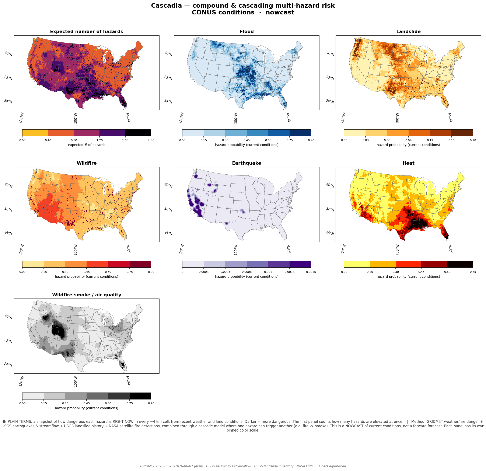
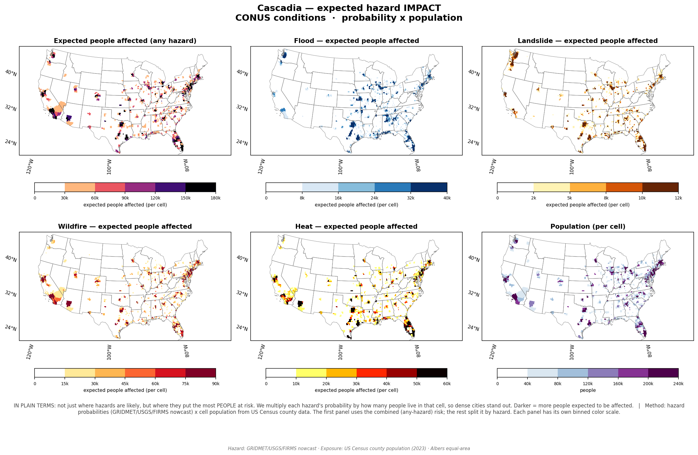
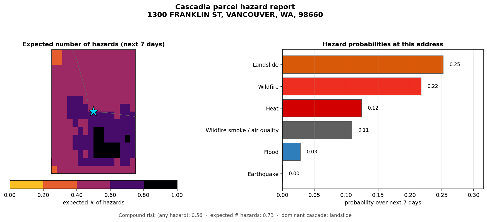
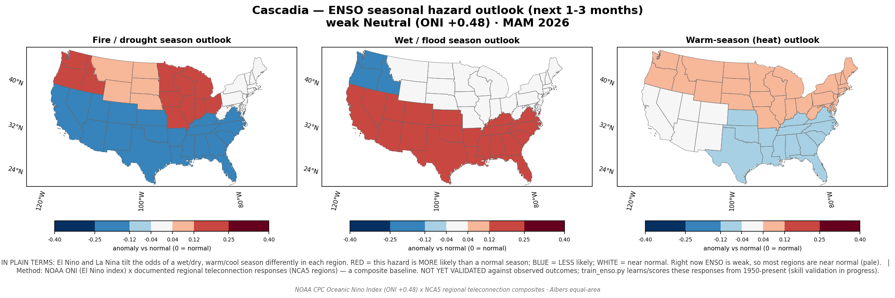
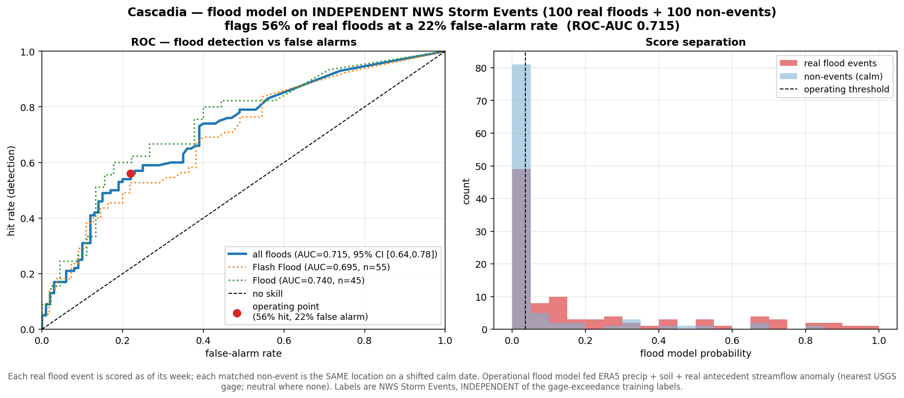
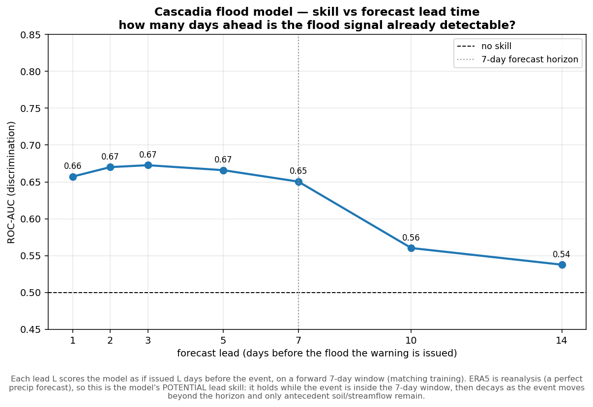
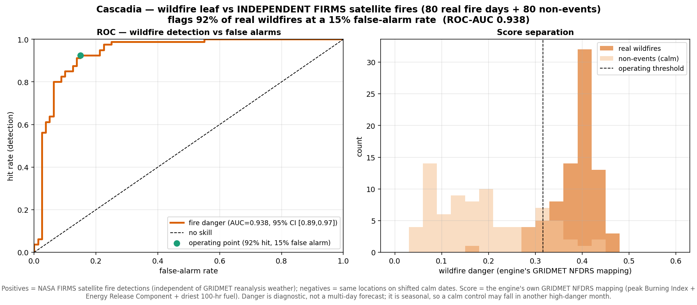
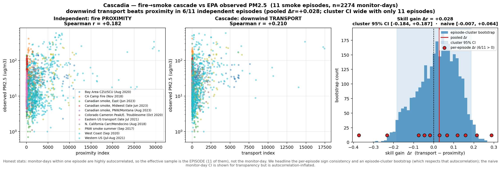
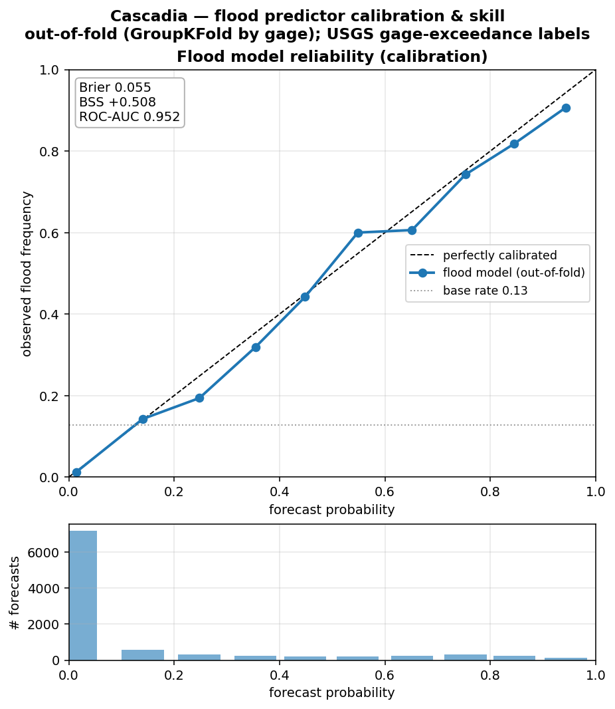
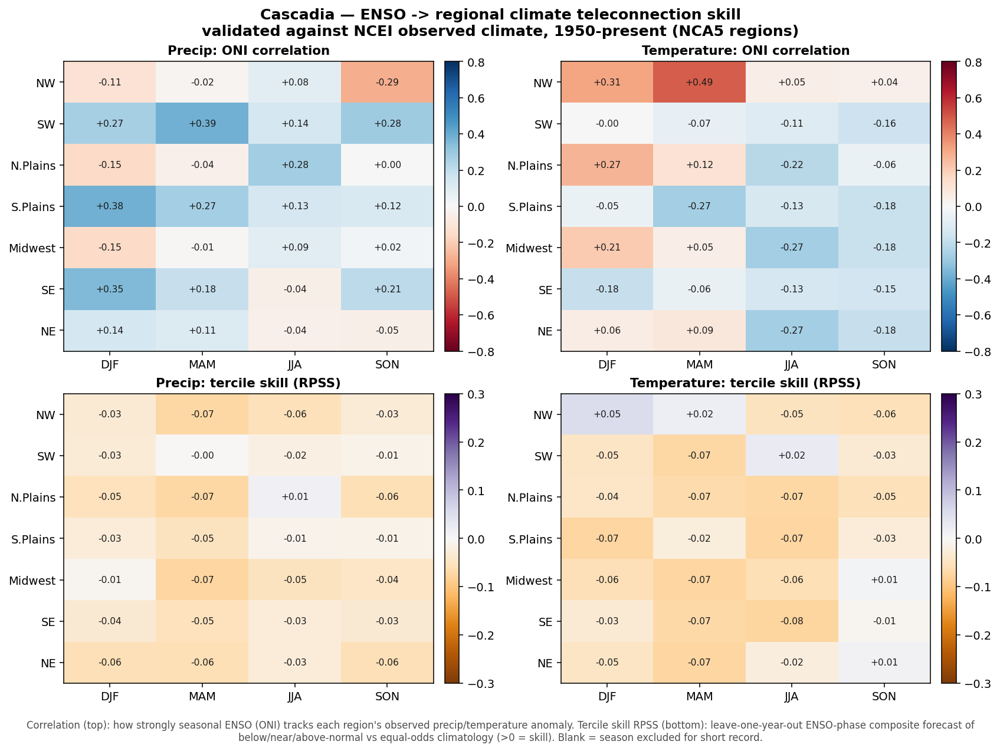

# 🌎 Cascadia — a compound & cascading multi-hazard engine

[](https://github.com/shawnatwsu/cascadia/actions/workflows/tests.yml)
[](LICENSE)

**Six natural hazards on one map — flood · earthquake · wildfire · landslide · heat · wildfire-smoke — from 100% free public data, for any US address up to the whole country.** Built on a probabilistic **cascade graph** (hazards can trigger one another), and honest about its measured skill: where it works, it shows the numbers; where it doesn't, it says so.

> ⚠️ Research prototype — **not** for operational or life-safety decisions. Defer to NWS, USGS, FEMA, and local emergency management. Covers six hazards; **not** hurricanes, tornadoes, or storm surge (NHC/SPC own those).

---

## See it

**National six-hazard nowcast** — `run.ps1 conditions conus`


**Expected people affected** (hazard × population) — `run.ps1 impact conus`


**Address-level report** for any US address — `run.ps1 parcel "..."`


**ENSO seasonal outlook** (honestly labeled weak signal) — `run.ps1 seasonal`


---

## Does it actually work? (every number reproduces with one command)

| Test | Result | Caveat |
|---|---|---|
| **Flood vs 100 real NWS flood events** (independent labels) | ROC-AUC **0.715**; **0.73** under a same-season control | daily grid under-resolves flash floods |
| **Flood lead time** | skill holds to **7 days**, decays after | ERA5 = a perfect precip forecast |
| **Wildfire vs 80 satellite (FIRMS) fires** | ROC-AUC **0.71** same-season (0.94 inflated by season) | danger is *diagnostic*, not a forecast |
| **Flood calibration** (out-of-fold) | ROC-AUC 0.95, Brier skill +0.51, reliability on diagonal | in-distribution |
| **Does the cascade add skill?** *(the core idea)* | **honest negative** — wins 6/11 smoke episodes, CI spans 0 | crude single-day transport proxy |
| **ENSO → US seasons** | r≈0.4 but **RPSS≈0** | weak predictor — labeled as such |

Each test uses **independent labels**, **matched non-events**, and **bootstrap CIs**. The flood/wildfire numbers aren't directly comparable — 0.72 is a 7-day *forecast*, 0.71 is same-week *danger discrimination*.

<details>
<summary><b>Validation figures</b> (click to expand)</summary>

Flood on independent events · lead-time · wildfire · cascade (honest negative) · calibration · ENSO








</details>

---

## Quick start

```bash
git clone https://github.com/shawnatwsu/cascadia
cd cascadia
# Windows: .\run.ps1   (sets up the venv + deps automatically)
# any OS:
python -m venv .venv && . .venv/bin/activate    # Windows: .venv\Scripts\activate
pip install -r requirements.txt
python run.py                                   # the live 7-day forecast map
```

Maps land in `outputs/` (the full path prints each run). Smoke + live fire need a free [NASA FIRMS key](https://firms.modaps.eosdis.nasa.gov/api/map_key/) (`setx FIRMS_MAP_KEY "…"`); everything else needs no key.

## Commands

| Command | What you get |
|---|---|
| `run.ps1` | Live **7-day forecast** map |
| `run.ps1 conditions <region>` | **4 km nowcast**, all six hazards |
| `run.ps1 impact <region>` | **Expected people affected** |
| `run.ps1 seasonal` / `subseasonal <region>` | Seasonal (ENSO) / weeks-2–6 outlook |
| `run.ps1 parcel "<address>"` | **Address-level** report |
| `run.ps1 performance` / `fireperf` / `leadtime` | Independent-event skill scores |
| `run.ps1 skill` / `validate` / `hindcast` | Calibration suite / disaster replays |
| `run.ps1 serve` | Interactive Leaflet dashboard |

Regions: `conus`, `pnw`, `california`, and the NCA5 regions (`northwest`, `southeast`, …). Add `sameseason` to `performance`/`fireperf` for the harder control.

## How it works

```
open feeds ─▶ spatial grid ─▶ per-hazard predictors ─▶ CASCADE GRAPH ─▶ compound risk
(no API key)  (CONUS-clipped)  (ML + physics)          (noisy-OR over    + exposure
                                                         gated triggers)
```

- **flood** → trained gradient-boosting model (isotonic-calibrated)
- **earthquake** → USGS smoothed-seismicity Poisson prior + aftershocks
- **wildfire** → GRIDMET fire-danger (Burning Index / ERC / fuel moisture)
- **landslide** → USGS inventory susceptibility × rainfall × terrain relief
- **heat** → heat index + wet-bulb temperature
- **smoke** → downwind plume transport from FIRMS fires + wind

Probabilities propagate through trigger edges (quake→landslide→flood, fire→smoke, heat→fire) to a compound-risk surface, then × Census population for exposure.

## Data (all free / open, mostly no key)

USGS (quakes, FDSN, streamflow, landslide inventory) · NOAA/NWS alerts · Open-Meteo (forecast + ERA5) · GRIDMET 4 km · NASA FIRMS *(free key)* · US Census · NOAA CPC ONI + NCEI · EPA AQS PM2.5. Full provenance in [DATA_SOURCES.md](DATA_SOURCES.md); per-hazard method/skill/limits in [MODEL_CARDS.md](MODEL_CARDS.md).

## Honest limitations

- **Six hazards, not all** — no hurricanes, tornadoes, storm surge, or winter storms.
- **Calibrated vs. index** — only **flood** and the **earthquake** prior are calibrated probabilities; landslide/wildfire/heat/smoke are relative 0–1 indices.
- **The cascade skill gain is not yet established** (honest negative); the seasonal outlook is a weak guide; maps are ~4–5 km; US-only.
- Research prototype — defer to official agencies.

## Roadmap

Calibrate the wildfire danger→probability mapping · improve the smoke transport model (multi-day dispersion) for a fair cascade retest · add tropical-cyclone (NHC) and severe-convective (SPC) leaves · gridded NDFD/GFS for CONUS-wide forward forecasts.

## License

[MIT](LICENSE) — free to use, fork, and build on. Tests: `pytest tests/`.

*Built with open data and a lot of honesty about what it can and can't do.*
