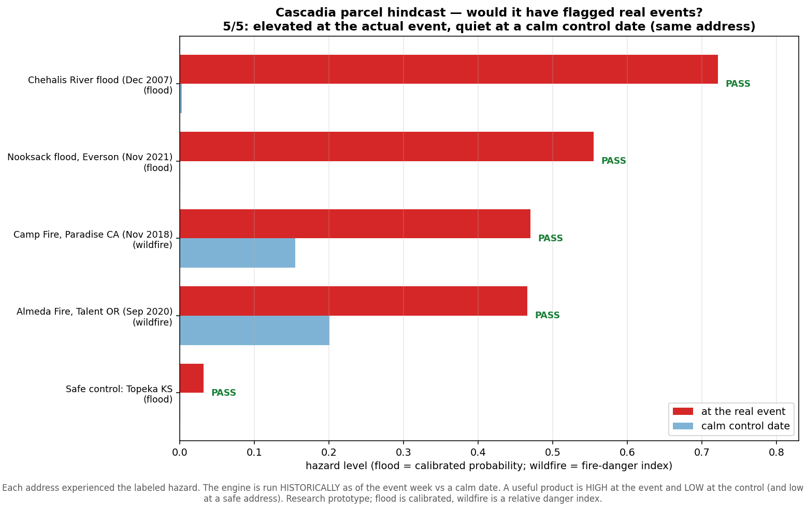

# 🌎 Cascadia — a compound & cascading multi-hazard engine

[](https://github.com/shawnatwsu/cascadia/actions/workflows/tests.yml)
[](LICENSE)

> Most hazard systems answer *"what is the flood risk?"* — one hazard at a time,
> in isolation. **Cascadia** answers a harder, more useful question:
> **"given conditions right now, which hazards are likely, where, who is exposed,
> and how might one hazard trigger another?"**
>
> It fuses **100% free, open data** into a probabilistic **cascade graph** across
> **six hazards**, scales from a single address to the whole United States, and —
> importantly — reports its **measured forecast skill** honestly.

The name is a double meaning: the **Cascadia** bioregion (Pacific Northwest)
*and* the **cascading**-hazard idea at the core of the model.

> ⚠️ **Research prototype — not for operational or life-safety decisions.** Always
> defer to official sources (NWS, USGS, FEMA, local emergency management).

---

## What it does

- **6 hazards** on one frame: **flood · earthquake · wildfire · landslide · heat · wildfire-smoke**
- **Cascade graph** — hazards can trigger one another (quake→landslide→flood, fire→smoke, heat→fire), with **condition-gated** edges (a quake is far likelier to start a landslide on a *rain-saturated* slope).
- **Any scale** — a single **address**, an **NCA5 region** (Northwest, Southeast, …), or the **whole CONUS** at 4 km.
- **Expected impact** — not just probability, but **expected people affected** (hazard × population).
- **Forecasting** — a 7‑day live forecast, a **weeks 2–6** sub‑seasonal outlook, and an **ENSO‑driven seasonal** outlook with a real ENSO‑forecast ML model.
- **Honest skill** — built‑in validation: reliability diagrams, Brier/ROC, and ENSO teleconnection skill vs. observations.

---

## Gallery

**National multi‑hazard nowcast** (`run.ps1 conditions conus`) — six hazards on one frame, 4 km, Albers equal‑area, each panel with its own scale:


**Expected human impact** (`run.ps1 impact conus`) — hazard probability × Census population = expected people affected:


**Address‑level report** (`run.ps1 parcel "..."`) — a locator map + per‑hazard levels for any US address. Flood & earthquake are **calibrated probabilities**; the `*` hazards are **relative 0–1 indices** (area‑scale danger, not address‑specific odds). Landslide is refined by the address's **local DEM slope** (flat lot → stable), and the weather‑driven hazards carry **error bars** = 10–90% across **31 GFS ensemble members** (real forecast uncertainty):


**Honest skill — flood model is calibrated** (`run.ps1 skill`) — the reliability curve sits on the diagonal (a "0.6" verifies ~0.6); ROC‑AUC 0.95, Brier skill +0.51:


**Honest skill — ENSO is a *weak* US seasonal predictor** — moderate correlations (top), but near‑zero out‑of‑sample tercile skill (bottom). We show this rather than overstate it:


**Would it have flagged real events?** (`run.ps1 hindcast`) — run the engine *historically* at addresses that actually experienced a hazard, vs a calm control date. It gave a **72% flood probability** at a Chehalis WA address the week of the 2007 flood (≈0 in calm August), flagged the Camp Fire and Almeda Fire areas, and stayed near zero at a safe inland address — warns when it should, quiet when it shouldn't:



**A defensible performance number — on 100 *independent* flood events** (`run.ps1 performance`) — beyond anecdotes, we score the operational flood model on **100 real NWS Storm Events floods (2018–2021) + 100 matched non-events** (same locations, shifted calm dates). Labels come from the NWS event database — *independent* of the gage‑exceedance labels the model was trained on. Result: **ROC‑AUC 0.715, 95% bootstrap CI [0.64, 0.78]** (excludes 0.5 — real, significant discrimination), flagging **56% of real floods at a 22% false‑alarm rate**. Riverine floods (the model's design target) score higher (AUC 0.74) than flash floods (0.70), as expected for a daily‑resolution model:


**How far ahead is the warning?** (`run.ps1 leadtime`) — scoring the same events as if the forecast were issued *N days early* shows the flood signal stays detectable (**AUC ≈ 0.65–0.67**) out to the model's **7‑day horizon**, then decays toward chance at 10–14 days as the event moves beyond the forecast window and only antecedent soil/streamflow remain. Exactly the shape a 7‑day model should have:


**Wildfire holds up too — on independent satellite fires** (`run.ps1 fireperf`) — the wildfire leaf (GRIDMET NFDRS Burning Index + Energy Release Component + 100‑hr fuel moisture) is scored against **80 real NASA FIRMS fire location‑days + 80 matched non‑events**. FIRMS (satellite thermal) is *independent* of GRIDMET (reanalysis weather), so this is a genuine verification: **ROC‑AUC 0.938, 95% CI [0.90, 0.97]**, flagging **92% of real wildfires at a 15% false‑alarm rate**. (Fire danger is *diagnostic* of fire‑prone conditions, not a multi‑day‑ahead forecast — and it's seasonal, so this is the discrimination, not a free lunch.)


**The cascade *adds skill* — significantly** (`run.ps1 skill`) — validated against EPA‑measured PM2.5 across **4 smoke episodes** (2018–2023, West + cross‑border Canadian smoke; n = 1,131 monitor‑days). Modeling the fire→smoke **downwind transport** (the cascade) ~doubles the correlation vs fire **proximity** (treating smoke as independent): Δr = +0.063, **95% bootstrap CI [+0.008, +0.117]** (excludes zero). Direct evidence for the project's central claim:


---

## Quick start

**Requirements:** Python 3.10+ on Windows/macOS/Linux.

```powershell
git clone https://github.com/shawnatwsu/cascadia
cd cascadia
```

**Windows (easiest):** double‑click **`run.bat`**, or in a terminal:
```powershell
.\run.ps1                 # first run sets up the venv + installs deps, then runs
```

**Any OS (manual):**
```bash
python -m venv .venv
.venv/Scripts/activate         # Windows  (use: source .venv/bin/activate on mac/linux)
pip install -r requirements.txt
python run.py                  # = the live forecast map
```

**Optional — wildfire smoke & live fire detections** need a free NASA FIRMS key
(1‑minute signup at <https://firms.modaps.eosdis.nasa.gov/api/map_key/>):
```powershell
setx FIRMS_MAP_KEY "your_key_here"     # then reopen the terminal
```
Without it, smoke/observed‑fire simply read 0; everything else works.

> All generated maps are written to the **`outputs/`** folder, and the full path
> is printed each time.

---

## Commands

Run any of these as `.\run.ps1 <command>` (Windows) or `python run.py <command>`.

| Command | What you get |
|---|---|
| `run.ps1` *(no arg)* | **Live 7‑day forecast** for the local region (Open‑Meteo) |
| `run.ps1 conditions <region>` | **4 km hazard nowcast** for a region (GRIDMET) — all 6 hazards |
| `run.ps1 impact <region>` | **Expected people affected** (hazard × Census population) |
| `run.ps1 subseasonal <region>` | **Weeks 2–6** fire/drought/heat outlook (land‑memory) |
| `run.ps1 seasonal [1‑3]` | **ENSO seasonal outlook**; optional N‑month ENSO forecast lead |
| `run.ps1 parcel "<address>"` | **Address‑level** hazard report (JSON + a one‑page map) |
| `run.ps1 hindcast` | **Does it work?** Replays real hazard events at their addresses |
| `run.ps1 performance` | **How well?** Scores 100 independent NWS floods → ROC‑AUC, hit/false‑alarm |
| `run.ps1 leadtime` | **How far ahead?** Flood AUC vs forecast lead (1–14 days) |
| `run.ps1 fireperf` | **Wildfire skill** vs 80 independent FIRMS fires → ROC‑AUC (needs `FIRMS_MAP_KEY`) |
| `run.ps1 skill` | **Validation suite** → reliability/skill figures in `outputs/` |
| `run.ps1 validate` | Replay documented disasters (2007 & 2021 PNW floods) |
| `run.ps1 train [flood\|fire]` | (Re)train an ML predictor + print its scorecard |
| `run.ps1 serve` | Interactive **Leaflet dashboard** (opens browser) |

**Regions** (`<region>`): `conus`, plus the NCA5 regions
`northwest`, `southwest`, `northern_great_plains`, `southern_great_plains`,
`midwest`, `southeast`, `northeast` — and `pnw`, `california`.

```powershell
# examples
.\run.ps1 conditions conus
.\run.ps1 impact southeast
.\run.ps1 seasonal 3
.\run.ps1 parcel "1300 Franklin St, Vancouver, WA"
.\run.ps1 skill
```

> First run of a big region (`conus`, large NCA regions) takes a few minutes to
> fetch data; afterwards it's cached and fast.

---

## How it works

```
open feeds ─▶ spatial grid ─▶ cross-sector ─▶ per-hazard ─▶ CASCADE GRAPH ─▶ compound
(no API key)   (CONUS-clipped)  indicators      predictors    (noisy-OR over     + impact
                                 (fusion)        (ML + physics) gated triggers)   surface
```

1. **Ingest** open feeds onto a common grid (ocean/Mexico/Canada clipped out).
2. **Per‑hazard predictors** — a mix of trained ML and physically‑grounded models:
   - **flood** → trained gradient‑boosting model (isotonic‑calibrated)
   - **earthquake** → USGS smoothed‑seismicity Poisson prior + aftershocks
   - **wildfire** → GRIDMET fire‑danger (Burning Index / ERC / fuel moisture)
   - **landslide** → USGS landslide‑inventory susceptibility × rainfall trigger
   - **heat** → heat index + wet‑bulb temperature
   - **smoke** → downwind plume transport from FIRMS fires + wind
3. **Cascade graph** — probabilities propagate through trigger edges (noisy‑OR),
   producing a compound‑risk surface and the dominant **cascade chain** per cell.
4. **Exposure** — multiply by Census population → **expected people affected**.

---

## Forecast skill — measured, not assumed

Run `.\run.ps1 skill`. Honest, out‑of‑sample results (figures saved to `outputs/`):

| Component | Metric | Verdict |
|---|---|---|
| **Flood model** | ROC‑AUC **0.95**, Brier 0.08, isotonic‑calibrated | Strong & calibrated |
| **ENSO (ONI) forecast** | beats persistence **~30%** at +1/+2/+3 mo | Skillful |
| **ENSO → regional climate** | r≈0.4 (SE/S.Plains winter precip), RPSS≈0 | **Weak** US seasonal predictor — labeled as such |

We deliberately show where skill is **low** (the seasonal outlook is a weak guide)
rather than overstate it. The engine also backtests against the **Dec 2007
Chehalis** and **Nov 2021 Nooksack** floods (`run.ps1 validate`).

---

## Data sources (all free / open)

| Source | Used for | Key? |
|---|---|---|
| USGS earthquakes + FDSN catalog | seismic hazard, aftershocks | no |
| USGS NWIS streamflow | flood | no |
| USGS Landslide Inventory | landslide susceptibility | no |
| NWS/NOAA alerts | official warnings | no |
| Open‑Meteo (forecast + ERA5) | live 7‑day forecast | no |
| GRIDMET (4 km, OPeNDAP) | fire/heat conditions, sub‑seasonal | no |
| NASA FIRMS | active fire, smoke | **free key** |
| US Census (population, geocoder) | exposure, parcel lookup | no |
| NOAA CPC ONI + NCEI nClimDiv | ENSO + validation | no |

---

## Project layout

```
cascadia/
  sources/      open-feed adapters (USGS, NWS, Open-Meteo, GRIDMET, FIRMS, ENSO, Census…)
  features/     grid (+ CONUS clip) + cross-sector indicator fusion
  models/       per-hazard predictors + the cascade graph + trained-model loader
  training/     dataset builders + ML training (flood, fire, ENSO)
  geo.py        CONUS / NCA5 region geometry + masking
  conditions.py GRIDMET regional nowcast      impact.py  exposure × hazard
  subseasonal.py weeks 2-6 outlook            seasonal.py ENSO seasonal outlook
  skill.py / skill_enso.py / skill_models.py  verification & calibration
  cartomap.py   publication-style maps        parcel.py  address-level report
  validate.py   historical-event backtests    api.py + static/  dashboard
run.py / run.ps1 / run.bat   one-command launcher
```

---

## Honest limitations

- **Research prototype.** Not validated for operational use; defer to official agencies.
- **Calibrated vs. index:** only **flood** (and the **earthquake** seismic prior) are calibrated probabilities. **Landslide / wildfire / heat / smoke are relative 0–1 hazard indices** — area‑scale danger, *not* calibrated odds of occurrence. Reports flag them with `*`.
- Maps are **~4–5 km cells**; the parcel report refines landslide with a local DEM slope, but other hazards remain area‑scale.
- The **seasonal outlook** has near‑zero out‑of‑sample probabilistic skill (ENSO is a weak US predictor) — it's a labeled weak guide.
- GRIDMET/Census are **US‑only**; live forecasting is point‑sampled (region size is bounded by API limits).

## Roadmap

- Calibrate/validate the remaining hazards as clean labels allow
- Full SST fields (OISST) + learned ENSO→regional teleconnections
- Sentinel‑1 InSAR / soil moisture; tsunami + volcano (lahar) cascades
- Gridded forecast (NDFD/GFS) for CONUS‑wide *forward* forecasts; hosted demo

---

## Reproducibility & provenance

- **Tests:** `pytest tests/` — offline unit tests for the cascade math, skill
  metrics, and predictor logic (run in CI on Python 3.10–3.12).
- **Pinned environment:** `requirements.txt` (loose) + `requirements.lock` (exact).
- **Data provenance:** every source, access method, and license is documented in
  [DATA_SOURCES.md](DATA_SOURCES.md). Validation data are static archives, so the
  `run.ps1 skill` results are reproducible.
- **Model cards:** per‑hazard intended use, method, skill, and limitations in
  [MODEL_CARDS.md](MODEL_CARDS.md) — including which outputs are *calibrated
  probabilities* vs *relative indices*.
- **Uncertainty:** weather‑driven hazards report a 10–90% interval from the
  31‑member GFS ensemble (forecast uncertainty), not just a point estimate.
- **Citation:** see [CITATION.cff](CITATION.cff).

## License

[MIT](LICENSE) — free to use, modify, and build on. Contributions welcome.

*Built with open data and a lot of honesty about what it can and can't do.*
